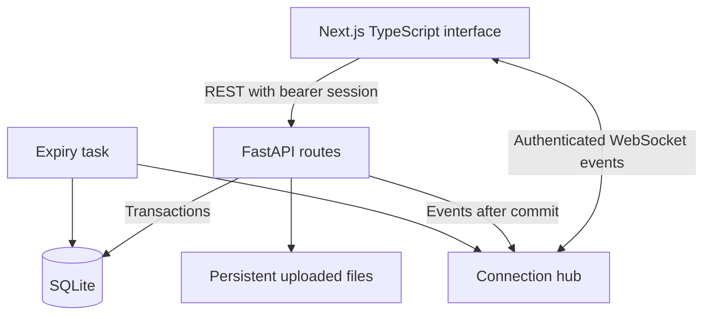

# Signal Clone — Full-stack messaging

An original implementation of the Signal messaging experience for the Scaler AI Labs SDE assignment. Next.js and TypeScript on the frontend; FastAPI, SQLite and authenticated WebSockets on the backend.

> Assignment demo, not the official Signal app. OTP verification is mocked with `123456`. There is no end-to-end encryption. Messages are stored in plaintext. Do not use this application for sensitive conversations.

## Features

- Username or phone-number registration, profile name/avatar, revocable seven-day sessions, logout.
- Contacts, conversation/contact search, all/unread/group filters, recent-activity sorting and unread counts.
- Real-time direct and group messages; typing, timestamps and sending/sent/delivered/read states.
- Persistent group memberships; server-enforced admin-only membership controls.
- Reconnection with exponential backoff, offline history resynchronization and idempotent message retries.
- Signal-inspired desktop navigation, chat bubbles, profile/settings dialogs and mobile layout.
- Image/file attachments, emoji reactions, quoted replies, disappearing messages, light/dark/system themes, keyboard shortcuts.
- Calls, stories, linked devices and advanced privacy options have explicit placeholders.
- Six fictional users, seven conversations and seeded message histories.

## Quick start

Requirements: Python 3.12+, Node.js 22 LTS+, npm. From the project root:

```bash
cd frontend
npm ci
npm run build
cd ../backend
python -m venv .venv
# macOS/Linux:
source .venv/bin/activate
# Windows PowerShell instead: .venv\Scripts\Activate.ps1
python -m pip install -r requirements.txt
python -m uvicorn app.main:app --host 127.0.0.1 --port 8000
```

Open **http://localhost:8000**. The database and demo data are created automatically on first startup. Subsequent starts preserve data. The downloadable ZIP also includes an already-built frontend export.

If PowerShell blocks virtual-environment activation, use `.venv\Scripts\python.exe` instead of `python` without changing execution policy. See [START_HERE.md](START_HERE.md).

For frontend development, keep the API running and use a second terminal:

```bash
cd frontend
npm run dev
```

Open http://localhost:3000. Development defaults to API port 8000. Production uses the same origin unless `NEXT_PUBLIC_API_URL` is set **at build time**.

### Docker alternative

```bash
docker compose up --build
```

Open http://localhost:8000. A named volume preserves the database and uploaded files. This uses a single backend worker, required by the in-memory WebSocket hub. Docker configuration is supplied; the image must be built and verified on the deployment host.

## Try the app

Sign in with the **Alex**, **Maya** or **Jordan** demo button. The other seeded usernames are `sam`, `priya`, `leo`; all use OTP `123456`. Register a new username with any display name, or a phone number without spaces.

Use Alex in a normal browser and Maya in a private window so they have independent sessions. Add contacts, open a conversation and send messages. Create a group from **New message → New group**. Open a chat's header to see members and its disappearing-message timer.

Keyboard shortcuts:

| Shortcut | Action |
| --- | --- |
| Ctrl/Cmd + Shift + N | New conversation |
| Ctrl/Cmd + K | Focus conversation search |
| Ctrl/Cmd + Shift + F | Search loaded messages in the current chat |
| Enter / Shift + Enter | Send / new line |
| Escape | Close a dialog or dismiss composer actions; return to list when no dialog is open |

## Architecture



Next.js is exported as static assets because this app does not need server-side rendering or Next.js API routes. FastAPI serves those assets, REST endpoints and `/ws` on one origin. This avoids cross-origin production configuration and preserves the exact required frontend/backend stack. SQLite and uploads live on a persistent disk.

REST creates durable state. WebSockets distribute change events and typing/presence. After reconnection, REST reloads current data; WebSockets are not used as the source of truth.

### Source map

```text
frontend/
  app/                 Next.js entry, layout and responsive CSS
  components/
    Auth.tsx           Mock verification and registration
    Messenger.tsx      Navigation, lists, search and modal coordination
    ChatPane.tsx       Messages, composer, attachment rendering and actions
    Dialogs.tsx        Contacts, groups, profile and settings
    ui.tsx             Shared avatar, buttons and accessible modal
  lib/
    api.ts             Authenticated HTTP requests and file downloads
    types.ts           Shared TypeScript domain types
    useMessenger.ts    Messaging state, sockets, reconnects and receipts
backend/
  app/
    main.py            Startup, WebSocket authentication, expiry and static hosting
    routes.py          REST routes and access checks
    db.py              SQLite schema and transactional connection helper
    models.py          Request validation
    security.py        Hashed session tokens and membership/role checks
    service.py         Conversation/message response serialization
    realtime.py        User-to-WebSocket connection hub
    seed.py            Idempotent fictional demo data
  tests/               Integration tests
```

## Database schema

All tables use real foreign keys. `PRAGMA foreign_keys=ON` runs for every connection; WAL mode and a busy timeout support short concurrent operations. Indexes cover chat history, membership lookup, user receipts and expiry.

| Table | Key | Purpose / relationships |
| --- | --- | --- |
| `users` | `id` | Unique case-insensitive username, display name, avatar, last-seen time |
| `sessions` | `token_hash` | Many sessions → one user; expiry and server-side revocation |
| `contacts` | `(owner_id, contact_id)` | Directed user → user relationship; cannot add oneself |
| `conversations` | `id` | Direct/group type, name, creator, timer; unique sorted-pair `direct_key` prevents duplicate direct chats |
| `conversation_members` | `(conversation_id, user_id)` | Many-to-many membership with `admin` or `member` role |
| `messages` | `id` | Conversation, sender, text, timestamp, optional quote/attachment/expiry |
| `message_receipts` | `(message_id, user_id)` | One delivery/read state per recipient at send time |
| `attachments` | `id` | Random file ID, owner, original name, type, size and private disk path |
| `reactions` | `(message_id, user_id)` | One emoji reaction per user per message |

`UNIQUE(sender_id, client_id)` makes retries idempotent. Self-referencing `messages.reply_to` uses `ON DELETE SET NULL` so expiry does not break replies. Messages, reactions and receipts use cascade cleanup where appropriate. A group member added later can view retained history; receipts are only created for people present when each message was sent.

See [docs/DATABASE_SCHEMA.md](docs/DATABASE_SCHEMA.md) for the entity-relationship diagram and the database design rationale.

## API overview

Interactive documentation: **/docs**. OpenAPI schema: **/openapi.json**. Protected endpoints require `Authorization: Bearer <token>`.

| Method | Path | Purpose |
| --- | --- | --- |
| GET | `/api/health`, `/api/demo-users` | Health and fictional demo identities |
| POST | `/api/auth/login` | Verify mocked OTP; register or create a session |
| GET / POST | `/api/auth/me`, `/api/auth/logout` | Restore / revoke session |
| PATCH | `/api/profile` | Update display name and avatar |
| GET | `/api/users?q=…` | Find registered people |
| GET / POST | `/api/contacts` | List / add contacts |
| GET / POST | `/api/conversations` | List / create chats |
| POST | `/api/conversations/{id}/members` | Admin adds a member |
| DELETE | `/api/conversations/{id}/members/{user_id}` | Admin removes a member |
| PATCH | `/api/conversations/{id}/timer` | Set expiry for future messages |
| GET / POST | `/api/conversations/{id}/messages` | Paginated history / send a message |
| GET | `/api/pending-deliveries` | Resynchronize undelivered messages |
| POST | `/api/receipts` | Acknowledge delivery / reading |
| POST | `/api/messages/{id}/reaction` | Toggle or replace your reaction |
| POST / GET | `/api/attachments`, `/api/attachments/{id}` | Upload / authorized download |

### WebSocket protocol

Connect to `/ws`, then send `{"type":"auth","token":"…"}` as the first frame within ten seconds. Tokens never appear in the URL. Server events: `connected`, `message`, `receipts`, `refresh`, `typing`, `presence`, `expired`, `pong`, `error`. Client events after authentication: `typing` with conversation ID and active boolean; `ping` as a heartbeat. Membership is checked before relaying typing. Revoking a session closes its sockets.

### Message status semantics

- **Sending:** optimistic local message while the HTTP request is in flight.
- **Sent:** the database transaction committed.
- **Delivered:** every intended recipient's client acknowledged receiving it.
- **Read:** every intended recipient viewed the chat in a visible browser tab.
- **Failed:** request failed; the Retry button reuses the client ID so a previously committed request is not duplicated.

A background tab can acknowledge delivery but does not mark messages read. Group receipts aggregate across recipients recorded at send time. A removed member's historical receipts remain an accurate record and can keep an older message from reaching all-read status.

## Verification

```bash
cd backend
python -m pip install -r requirements-dev.txt
python -m pytest -q
cd ../frontend
npm ci
npm run typecheck
npm run build
```

Tests cover mocked auth, persistent accounts, logout, contact creation, direct-chat deduplication, idempotent sends, receipt transitions, pagination, group permissions, unauthorized access, quotes, reactions, expiry, private attachments and actual WebSocket message/typing/receipt events.

The final requirement-by-requirement audit is in [`docs/FINAL_AUDIT.md`](docs/FINAL_AUDIT.md). It separates locally tested functionality from browser, Docker-host and public-deployment checks that still require the candidate's environment.

See [docs/REQUIREMENTS.md](docs/REQUIREMENTS.md) for requirement mapping and [docs/QA_REPORT.md](docs/QA_REPORT.md) for the executed verification report. See [docs/EXPLAIN_THE_CODE.md](docs/EXPLAIN_THE_CODE.md) before the evaluation interview.

## Assumptions and limitations

- This is an assignment demo. Fixed OTP means anyone can impersonate an account; no real identity verification, E2EE, key exchange or spam protection is claimed.
- Bearer tokens are stored in localStorage for browser persistence; only SHA-256 token hashes are stored server-side. A production application should use hardened identity verification, session storage and abuse controls.
- One FastAPI worker/process only. A production multi-worker deployment needs shared pub/sub (for example Redis) and a database strategy for multiple instances.
- Group creator remains the sole admin. Admin transfer, leaving/deleting groups and blocking are outside the required scope.
- Disappearing-message timers start at **send time**, intentionally simpler than Signal's actual semantics; the UI and docs state this. Expired text is hidden immediately on fetch and deleted by a two-second task. Files already downloaded cannot be recalled; uploaded blobs are not securely erased on message expiry.
- User avatars are resized locally to 192×192. Attachment uploads are limited to 10 MB; dangerous file types are downloaded rather than rendered as HTML.
- In-chat search covers currently loaded messages; load older messages to expand the search. Contact search is limited to 100 results.
- Calls, stories, linked devices and advanced privacy settings are placeholders, as permitted. UI is an original Signal-inspired recreation, not a claim of pixel-perfect parity with every Signal version.
- Docker deployment and public GitHub publication require your hosting/GitHub account. Do not submit a localhost address.

## Deploy and submit

Follow [docs/DEPLOYMENT.md](docs/DEPLOYMENT.md). The supplied Dockerfile serves the full app from one URL. `render.yaml` provisions a web service and persistent disk; it specifies a paid plan, so review provider costs before creating it. No paid resources have been provisioned by this project.

After creating an empty public GitHub repository in your account:

```bash
git init
git add .
git commit -m "Build Signal-style full-stack messaging application"
git branch -M main
git remote add origin https://github.com/YOUR_USERNAME/YOUR_REPOSITORY.git
git push -u origin main
```

Commit the npm lockfile. Do not commit local databases, sessions, uploaded private files, `.env`, virtual environments or dependency folders. Submit the public repository URL and the working deployed URL.

## Design references and originality

Visual references only: [Signal message UI](https://signal.org/blog/message-requests/), [Signal desktop navigation](https://signal.org/blog/call-links/), [Signal appearance settings](https://support.signal.org/hc/en-us/articles/360007320951-Chat-Colors-Wallpaper-and-Themes). Framework references: [FastAPI WebSockets](https://fastapi.tiangolo.com/advanced/websockets/), [Next.js output](https://nextjs.org/docs/app/api-reference/config/next-config-js/output).

No existing Signal-clone repository was copied. Icons are from Lucide; the rest of the implementation and demo content were authored for this assignment with AI assistance. Signal and its branding belong to their respective owners. Understand, review and personalize the code before presenting it as your submission.

# signal-clone
76238172303c3adf513a1a74dafc7aa43490114f
