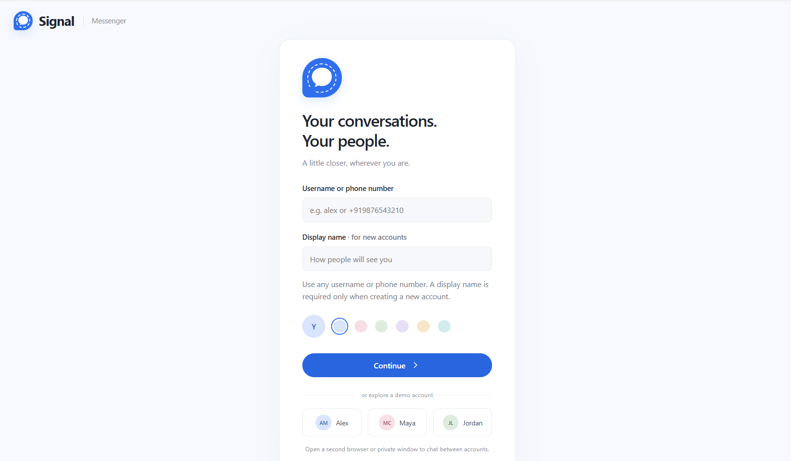
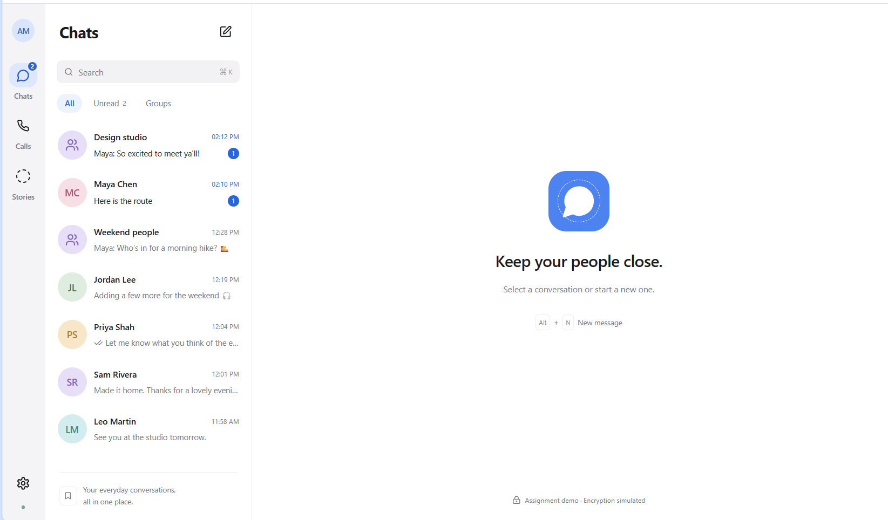
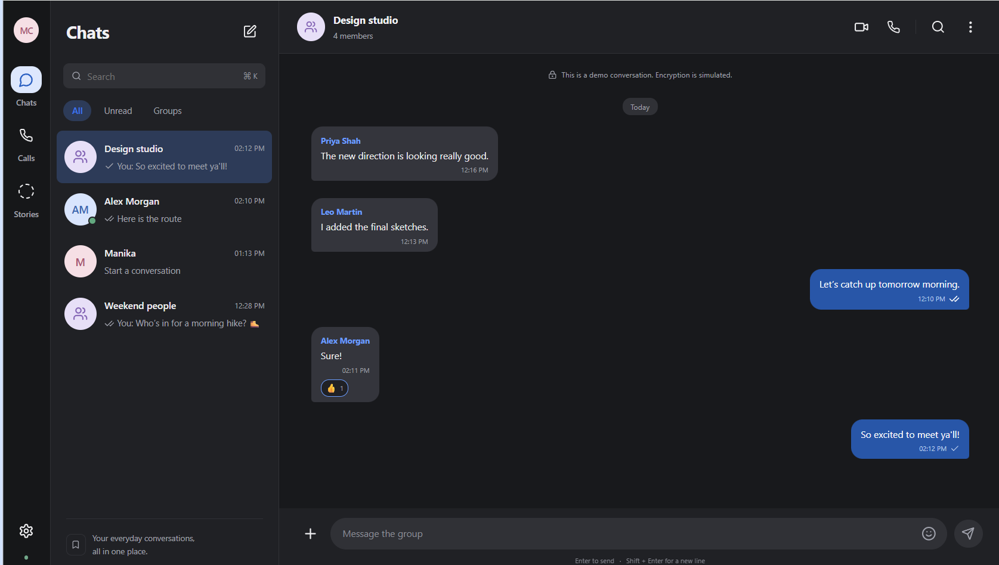
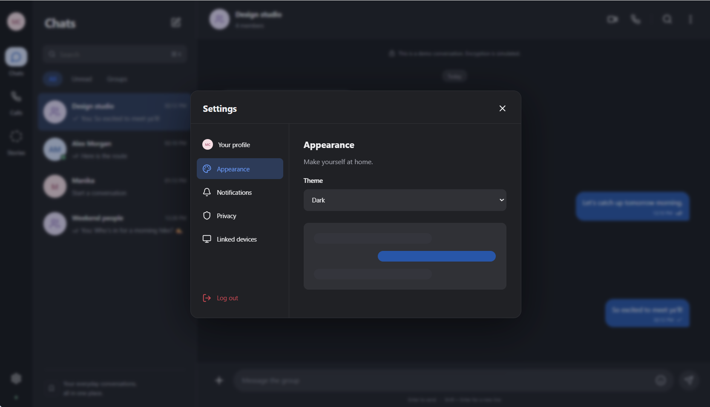

# Signal Clone

An original, full-stack Signal-inspired messaging platform built for the
Scaler AI Labs SDE Fullstack Assignment.

The project focuses on the core messaging experience: authentication,
contacts, one-to-one and group conversations, SQLite-backed messaging data,
and real-time updates through authenticated WebSockets.

> This is an assignment demonstration and is not the official Signal
> application. OTP verification is mocked with 123456, messages are stored in
> plaintext, and real end-to-end encryption is not implemented. Do not use it
> for sensitive conversations.

## Links

- **Live demo:** https://signal-clone-g5ln.onrender.com
- **GitHub repository:** https://github.com/ManikaR26/signal-clone
- **API documentation:** https://signal-clone-g5ln.onrender.com/docs

The free Render service may take a few seconds to wake after inactivity.

## Demo accounts

All seeded accounts use the fixed OTP **123456**.

| Username | Display name |
| --- | --- |
| alex | Alex Morgan |
| maya | Maya Chen |
| jordan | Jordan Lee |
| sam | Sam Rivera |
| priya | Priya Shah |
| leo | Leo Martin |

Use Alex in one browser window and Maya in an incognito window to demonstrate
real-time messaging, typing indicators, delivery receipts, and read receipts.

## Screenshots

### Messenger Interface

### Real-Time Messaging

### Group Chat and Admin Controls

### Dark Mode and Settings

## Evaluation demo flow

1. Sign in as Alex with OTP `123456`.
2. Open a second browser or incognito window and sign in as Maya.
3. Add each user as a contact and open their direct conversation.
4. Send messages in both directions and observe typing and receipt states.
5. Refresh the page and confirm that the message history remains available
   during the active session.
6. Create a group, add members, and send a group message.
7. Open group details and test the admin-only add/remove member controls.
8. Test reactions, replies, attachments, disappearing messages, and dark mode.
9. Open Settings and inspect the appearance, privacy, notifications, and
   placeholder sections.

### Keyboard shortcuts

| Shortcut | Action |
| --- | --- |
| Alt + N | Start a new conversation |
| Ctrl/Cmd + K | Focus conversation search |
| Ctrl/Cmd + Shift + F | Search loaded messages in the current chat |
| Enter | Send a message |
| Shift + Enter | Insert a new line |
| Escape | Close a dialog or dismiss composer actions |

## Features

### Required functionality

- Username or phone-number registration with mock OTP verification
- Login, logout, profile display name, avatar, and persistent sessions
- Contact search, conversation search, filters, recent sorting, unread counts,
  last-message previews, and presence information
- Real-time one-to-one text messaging with timestamps and message persistence
- Sending, sent, delivered, read, and failed message states
- Typing indicators, reconnection, offline recovery, and idempotent retries
- Group creation, member management, group messaging, and admin permissions
- SQLite relational schema with foreign keys, indexes, and transactional writes
- Signal-inspired conversation list, chat pane, message bubbles, dialogs,
  toasts, loading states, error states, and responsive layout
- Settings sections for privacy, notifications, appearance, and linked devices

### Additional implemented features

- Emoji reactions
- Reply-to messages with quoted previews
- Image and file attachments with authorized downloads
- Disappearing-message timers
- Light, dark, and system appearance modes
- Keyboard shortcuts

### Explicit placeholders

The following are represented honestly as placeholders, as allowed by the
assignment:

- Voice and video calls
- Stories
- Linked-device synchronization
- Actual end-to-end encryption and cryptographic key exchange

## Technology stack

| Layer | Technology |
| --- | --- |
| Frontend | Next.js, React, TypeScript, CSS |
| Backend | Python, FastAPI, Uvicorn |
| Database | SQLite using Python's sqlite3 module |
| Real-time communication | Authenticated WebSockets |
| Icons | Lucide React |
| Deployment | Docker on Render |

The frontend is exported as static files. FastAPI serves the frontend, REST
API, WebSocket endpoint, and uploaded files from one origin.

## Architecture

~~~mermaid
flowchart TD
    UI["Next.js TypeScript UI"] -->|REST with bearer session| API["FastAPI routes"]
    UI <-->|Authenticated WebSocket events| HUB["Connection hub"]
    API -->|Transactions| DB[("SQLite")]
    API -->|Events after commit| HUB
    API --> FILES["Local uploaded files"]
    EXPIRY["Expiry task"] --> DB
    EXPIRY --> HUB
~~~

### Data flow

1. The user signs in through the REST API using the fixed demo OTP.
2. The backend creates a session and returns a bearer token.
3. The frontend stores the session token locally so refreshes can restore the
   account.
4. REST endpoints create conversations, messages, memberships, receipts,
   reactions, and attachments in SQLite.
5. The WebSocket connection broadcasts committed events to the correct
   conversation members.
6. After reconnecting, the frontend reloads REST data; WebSockets are used for
   live updates, not as the source of truth.

The deployment uses one FastAPI worker because the current WebSocket hub is
in-memory. A multi-worker production system would need shared pub/sub such as
Redis.

## Run locally

### Requirements

- Python 3.12 or newer
- Node.js 22 LTS or newer
- npm
- Docker is optional

### Windows PowerShell

Run these commands from the project root:

~~~powershell
cd frontend
npm ci
npm run build

cd ..\backend
py -m venv .venv
.\.venv\Scripts\python.exe -m pip install -r requirements.txt
.\.venv\Scripts\python.exe -m uvicorn app.main:app --host 127.0.0.1 --port 8000
~~~

Open http://localhost:8000.

If PowerShell blocks activation, the commands above intentionally use the
virtual environment's Python executable directly, so activation is not
required.

### macOS or Linux

~~~bash
cd frontend
npm ci
npm run build

cd ../backend
python3 -m venv .venv
source .venv/bin/activate
python -m pip install -r requirements.txt
python -m uvicorn app.main:app --host 127.0.0.1 --port 8000
~~~

Open http://localhost:8000. On first startup, SQLite tables and fictional
demo data are created automatically.

### Frontend development mode

Keep the FastAPI server running and use a second terminal:

~~~bash
cd frontend
npm ci
npm run dev
~~~

Open http://localhost:3000. The development frontend communicates with the
backend on port 8000. After changing the frontend, run npm run build before
using the single-origin production-style URL on port 8000.

### Docker

~~~bash
docker compose up --build
~~~

Open http://localhost:8000. The Compose configuration uses one worker and a
named volume for local SQLite data and uploaded files.

## Repository structure

~~~text
signal-clone/
├── backend/
│   ├── app/
│   │   ├── main.py          Startup, static hosting, expiry task, WebSockets
│   │   ├── routes.py        REST endpoints and access checks
│   │   ├── db.py            SQLite schema and connection helper
│   │   ├── models.py        Request validation models
│   │   ├── security.py      Session and membership checks
│   │   ├── service.py       Response and message serialization
│   │   ├── realtime.py      WebSocket connection hub
│   │   └── seed.py          Idempotent demo data
│   ├── tests/               Backend integration and WebSocket tests
│   ├── requirements.txt
│   └── requirements-dev.txt
├── frontend/
│   ├── app/                 Next.js entry points and global CSS
│   ├── components/          Auth, messenger, chat, dialogs, and shared UI
│   └── lib/                 API client, types, and messaging state
├── docs/
│   ├── DATABASE_SCHEMA.md
│   ├── DEPLOYMENT.md
│   ├── FINAL_AUDIT.md
│   ├── QA_REPORT.md
│   └── REQUIREMENTS.md
├── screenshots/
├── Dockerfile
├── compose.yaml
├── render.yaml
└── README.md
~~~

## Database design

The backend uses related SQLite tables instead of storing an entire
conversation as one JSON object.

| Table | Purpose |
| --- | --- |
| users | Accounts, display names, avatars, and presence timestamps |
| sessions | Hashed session tokens, expiry, and revocation |
| contacts | Directed user-to-user contact relationships |
| conversations | Direct or group conversation metadata |
| conversation_members | Many-to-many membership with admin/member roles |
| messages | Text, timestamps, sender, reply, attachment, and expiry data |
| message_receipts | Per-recipient delivered/read state |
| attachments | Authorized file metadata and storage paths |
| reactions | One reaction per user per message |

Foreign keys, unique constraints, indexes, and transactions protect the
relationships. A unique sender/client-message ID makes message retries
idempotent.

See [docs/DATABASE_SCHEMA.md](docs/DATABASE_SCHEMA.md) for the entity-
relationship diagram and design rationale.

## API and WebSocket overview

Interactive API documentation is available at /docs and the OpenAPI schema is
available at /openapi.json.

| Method | Endpoint | Purpose |
| --- | --- | --- |
| GET | /api/health | Health check |
| POST | /api/auth/login | Register or log in with mock OTP |
| GET | /api/auth/me | Restore the current session |
| POST | /api/auth/logout | Revoke the current session |
| PATCH | /api/profile | Update display name or avatar |
| GET | /api/users?q=... | Search registered users |
| GET / POST | /api/contacts | List or add contacts |
| GET / POST | /api/conversations | List or create conversations |
| GET / POST | /api/conversations/{id}/messages | Load or send messages |
| POST | /api/conversations/{id}/members | Add a group member |
| DELETE | /api/conversations/{id}/members/{user_id} | Remove a group member |
| POST | /api/receipts | Acknowledge delivery or reading |
| POST | /api/messages/{id}/reaction | Add or remove a reaction |
| POST | /api/attachments | Upload an attachment |
| GET | /api/attachments/{id} | Download an authorized attachment |

The WebSocket endpoint is /ws. The client authenticates in the first frame
with a session token. Events include connected, message, receipts, refresh,
typing, presence, expired, pong, and error.

### Message lifecycle

- **Sending:** optimistic frontend state while the request is in progress.
- **Sent:** the database transaction has committed.
- **Delivered:** intended recipients acknowledged receiving the message.
- **Read:** recipients viewed the conversation in an active browser tab.
- **Failed:** the request failed and can be retried with the same client ID.

## Verification

Run backend tests:

~~~bash
cd backend
python -m pip install -r requirements-dev.txt
python -m pytest -q
~~~

Run frontend checks:

~~~bash
cd frontend
npm ci
npm run typecheck
npm run build
~~~

The test suite covers authentication, persistence, logout, contacts,
conversation creation, idempotent sends, receipts, pagination, group
permissions, unauthorized access, replies, reactions, expiry, attachments,
typing events, and WebSocket message delivery.

The requirement mapping and QA details are available in:

- [docs/REQUIREMENTS.md](docs/REQUIREMENTS.md)
- [docs/QA_REPORT.md](docs/QA_REPORT.md)
- [docs/FINAL_AUDIT.md](docs/FINAL_AUDIT.md)

## Deployment

The application is deployed as one Docker web service:

- Next.js is built into static files during the Docker build.
- FastAPI serves the frontend and backend from one origin.
- WebSockets use the same HTTPS host.
- Render starts one Uvicorn worker.
- Demo data is seeded with SEED_DEMO=1.

The current demo uses Render's free plan and does not use a paid persistent
disk. Therefore, custom SQLite records and uploaded files may reset when the
service is restarted or redeployed. The fictional demo accounts and seed data
are recreated automatically.

Deployment environment:

| Variable | Value |
| --- | --- |
| DATA_DIR | /app/data |
| FRONTEND_DIST | /app/frontend/out |
| SEED_DEMO | 1 |
| DEMO_OTP | 123456 |
| NEXT_PUBLIC_API_URL | Unset for same-origin deployment |

See [docs/DEPLOYMENT.md](docs/DEPLOYMENT.md) for the deployment workflow and
troubleshooting notes.

## Assumptions and limitations

- OTP verification is intentionally fixed and mocked. Anyone who knows the
  OTP can sign in as a demo account.
- Messages are stored in plaintext. No real identity verification, key
  exchange, end-to-end encryption, or spam protection is claimed.
- Session tokens are persisted in browser localStorage for this assignment.
  Only token hashes are stored by the backend.
- The group creator remains the only administrator. Admin transfer, blocking,
  leaving groups, and group deletion are outside the assignment scope.
- Disappearing-message timers start at send time. This is a simplified demo
  behavior and is not Signal's exact implementation.
- In-chat search covers currently loaded messages. Older messages must be
  loaded before they can be found.
- Calls, stories, linked devices, and advanced privacy features are
  placeholders.
- The UI is an original Signal-inspired recreation, not a claim of
  pixel-perfect parity with every Signal release.

## Originality and attribution

This project was implemented from the assignment requirements and does not
copy an existing Signal-clone repository. The UI and demo data are original.
Icons are provided by Lucide React. Signal and its branding belong to their
respective owners.

AI tools were used as development assistance. The implementation should be
reviewed and understood before being presented during evaluation.
