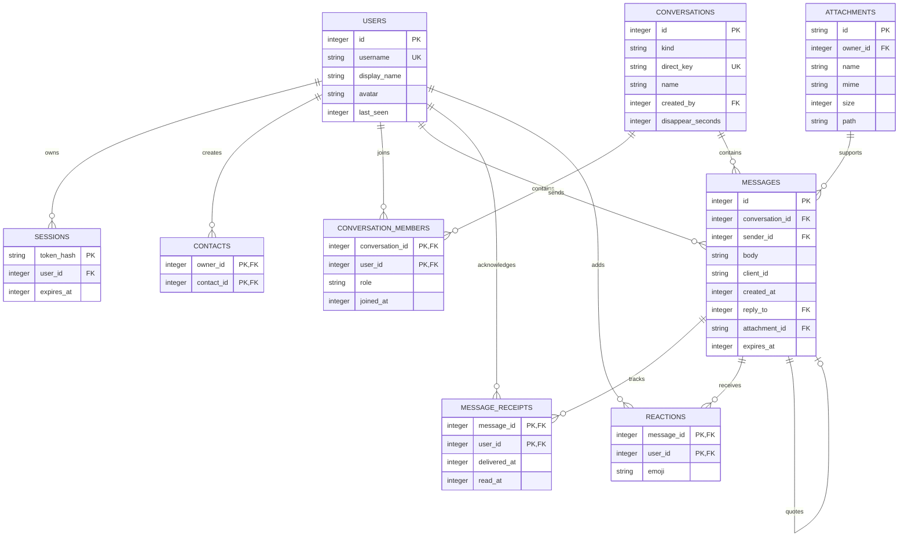

# Database schema

The application uses SQLite as its source of truth. Each message is stored as
its own row; conversations are not stored as one JSON object. Foreign keys are
enabled for every connection, and short transactions commit durable state
before real-time events are broadcast.

## Design decisions

- `conversation_members` supports both direct and group conversations without
  storing comma-separated user IDs.
- `message_receipts` is separate because each group member can have a
  different delivery or read state.
- `UNIQUE(sender_id, client_id)` makes message retries idempotent.
- `direct_key` prevents duplicate direct conversations for the same pair.
- The current implementation uses parameterized `sqlite3` statements instead
  of an ORM. This keeps the required SQLite schema visible and avoids adding
  unnecessary abstraction for a single-instance assignment demo.
